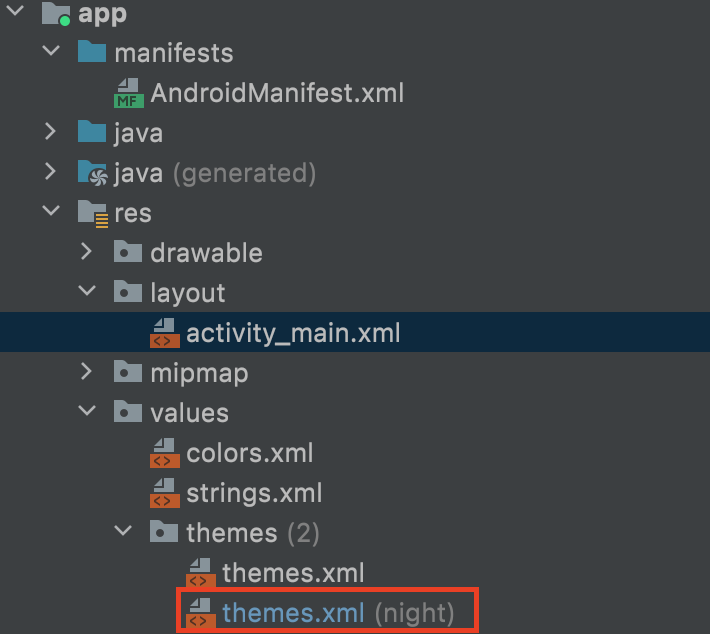

# ユーザーがダークテーマを使用していてもアプリでは通常テーマを使用する

プロジェクトを作成すると、ダークモードと通常モード用のthemes.xmlが生成され、OS側でユーザーの設定によって自動で切り替えて使うようになっているらしい

実験的に作っているアプリだと色合いのことを気にしていられないので、とりあえず`ライトモード(通常モード)`で固定にしたい

## 書き換える箇所

その場合は、以下のファイルを書き換える

`res->values->themes->themes.xml(night)`



```xml
<style name="Theme.ViewSample" parent="Theme.MaterialComponents.DayNight.DarkActionBar">
```

これを、以下のように書き変える

```xml
<style name="Theme.ViewSample" parent="Theme.MaterialComponents.Light.DarkActionBar">
```

## プレビューテーマの変更方法

ちなみに、layoutファイルをデザインモードで開いているときに、以下の部分のドロップダウンでテーマごとの色合いの変化を見ることができる

